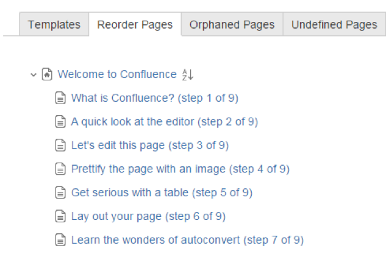
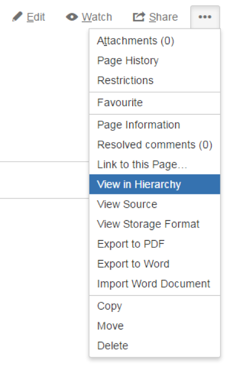

# Comment tp exercise 1
###Some comments about what i done
1. I added environment variable due to this test can be run from CI like bamboo against different environments
2. All test can be run independently
3. better to avoid xpath like this
   /html//ul[@class='RecentlyUpdatedContent_listContainerStyle_3Vv']/li/div/div[@class='update-item-title']/a)[1]
   it's better to change for css='.update-item-title>a' and put into the list<WebElement> and then get the element with index 1
4. this set up "manage().timeouts().implicitlyWait(10, TimeUnit.SECONDS);" is very important for driver because it set up default time to wait for elements
5. here i create properties for storing urls and credentials from file by usually i prefer use MySQL database

###What i would like to done
1. I haven't done but all "Thread.sleep();" must be changed for waiting specific element
2. It will be really good to add screenshot capture in case of error/crash
3. It will be really good to add possibility to run test in headless mode for instance with xvfb. especially this needs for CI where no display  
4. add asserts into testRestriction test
5. add assert for environment variable "ENV"
6. it's better to parametrize dimension to test page scaling
7. for test like testRestriction. if previous test failed it's required to delete all preparation for previous test
8. in CreatePageTest it will be better to move "String[] testData = {"test page title", "{status:colour=Green|title=Testing Create Page|subtle=true}"}" into parameters

general comment:
1. it is bad to have target folder in git repo

# Atlassian Quality Engineering Hiring - Technical Exercises

A recruitment exercise for Atlassian Quality Engineering

#### Contents

* [Introduction](#markdown-header-introduction)
* [Exercise 1 – Automation](#markdown-header-exercise-1-automation)
* [Exercise 2 – Exploratory Testing](#markdown-header-exercise-2-exploratory-testing)
* [Submitting the Exercises](#markdown-header-submitting-the-exercises)

## Introduction

Quality Engineers at Atlassian are our (not so) secret weapon. They not only help teams continually improve the quality of the software they create, but they also help teams do it more efficiently. In short, our Quality Engineers are essential for shipping quality software faster.

Our developers know this. Our quality practices are regularly voted the most satisfying aspect of how we develop software at Atlassian. As such, developers constantly pull Quality Engineers into collaborating on their work. This is not a company where code is thrown over the wall to test, nor a place for people who don’t want to be deeply involved in the development process.

To be effective, our Quality Engineers need strong testing, technical and collaboration skills. The aim of these exercises is to allow you to demonstrate some of those.

## Exercise 1 – Automated Testing

### Goal

Quality Engineers at Atlassian are expected to assist their team with advice on all aspects of automated testing, across numerous languages. The intention of this exercise is to demonstrate your ability to provide guidance on how to make automated tests valuable, robust and maintainable.

### Scenario

Picture yourself working with a team of developers who create and maintain features in Confluence Cloud, Atlassian's hosted Wiki product. The team have decided to write some automated UI tests with Selenium Webdriver using the [PageObjects](https://github.com/SeleniumHQ/selenium/wiki/PageObjects) pattern. They have written tests to ensure new pages can be created and that page restrictions work.  

The developers are inexperienced with UI testing and whilst their overall approach is ok, they've fallen into a lot of automation antipatterns. They've asked you to fix anything wrong with the tests to show them where they can improve.  They will use your changes as a reference for designing future tests.

### Requirements

* Apache [Maven](https://maven.apache.org/) version 3 – the framework uses Maven for running tests and managing dependencies
* Google [Chrome](https://www.google.com.au/chrome/) Browser – the framework is set up to automatically use this
* Atlassian [Confluence Cloud](https://www.atlassian.com/ondemand/signup/form?product=confluence.ondemand) – follow the link to sign up for a 7 day trial (if the trial runs out, you can just sign up again with a different site name)

### Getting Started

1. Make sure you've got all the requirements above
1. Log in to Confluence and create a new Space
1. [Add a new user](https://confluence.atlassian.com/doc/add-users-and-set-permissions-349635148.html) to Confluence
1. [Fork](https://bitbucket.org/atlassian-qe/atlassian-qe-hiring-exercise/fork) this repository
1. [Clone](https://confluence.atlassian.com/display/BITBUCKET/Clone+a+repository#Clonearepository-CloningaGitrepository) your new fork
1. On your local clone: 
	* Use your Confluence Cloud site address to update the siteURL variable, found here: `src/test/java/com/webdriver/tests/TestBase.java`
	* Update the username & password variables in both test files to use the user you set up in Step 2
1. Run the tests using Maven: `mvn clean install`

It is up to you to determine what needs to done - add, modify or remove code wherever necessary to demonstrate how the developers should create tests that are robust, maintainable and valuable.

To limit the time required for this exercise, you don't need to worry about writing extra/new tests - just fix up what is there. If you are having trouble implementing an idea, don't have time to make the changes you want to, or just want to provide extra information, just leave comments at the top of this readme. 

You're now ready to start updating the code!

### Completing the Exercise
**Note:** Please do **NOT** raise a pull request against the original exercise repository. Doing so will share your code with other candidates.

[Commit](https://confluence.atlassian.com/display/BITBUCKET/Work+on+local+source+files#Workonlocalsourcefiles-WorkingonfilesinGit) your changes and [push](https://confluence.atlassian.com/display/BITBUCKET/Push+updates+to+a+repo) them back up to your Bitbucket repository. When you're done with both exercises, send them to us by completing the steps shown in the [Submitting The Exercises](#submit) section below.

## Exercise 2 – Exploratory Testing

### Goal

Coaching developers in testing skills is a regular part of the job for Atlassian's Quality Engineers. We teach our developers Exploratory Testing to help them to think critically and uncover high impact risks in their own work. The intention of this exercise is to allow you to demonstrate your ability to identify valid risks in a feature, without using specifications or scripted test cases.

### Scenario

A new developer in your team has just completed a feature in Confluence called _Reorder Pages_. It displays all the pages that belong to a specific space in an expandable tree and allows the user to rearrange the page order and hierarchy. 

The developer has already tested that basic happy-path sorting and drag & drop scenarios are working, but they are not sure what other risks they should be looking for and have asked for your help.

### Getting Started

* You can use the same Confluence Cloud instance that you created for the previous exercise
* The _Reorder Pages_ feature can be accessed by clicking “View in Hierarchy” from the “...” menu in the top-right corner when viewing a Confluence page.

### Completing the Exercise

The scope of the exercise is limited to the _Reorder Pages_ tab. You should not test the other tabs (Orphaned Pages, Undefined Pages, etc.) or other Confluence features, except where they help you assess risks related directly to this feature.

1. Before starting, read the _Recording Your Results_ section below
1. Perform an initial 30 minute round of exploratory testing
	* Aim to go beyond basic happy-path functional testing - consider other areas of risk
1. Once you are familiar with the feature, think about what other areas/risks need to be explored and determine what further testing the feature may need before you would consider it ready to be released to production

### Recording Your Results

Create a file (Text, PDF, Word or Markdown) containing:

* A short description of the approach you took to your testing.
* A bulleted list of the scenarios you tried, even if they were successful. For example:
	* “Tried to drag a parent page to become a grandchild of itself”
	* “Tried to use the web service to make a page a child of itself”
* A quick description of any bugs you found. It’s OK to not have found any – we’re much more interested in your test ideas and approach
* Your list of further testing areas that you would want completed before you would be comfortable shipping this feature to millions of users.

We're more interested in your approach to identifying risks & scenarios than we are in the number of bugs found, so whilst you can continue exploratory testing beyond 30 minutes if you would like to, we generally find the value in doing so is limited.

Once completed, please push the file to your Bitbucket repository that was set up during Exercise 1.

## Submitting The Exercises
**Note:** Please do **NOT** raise a pull request against the original exercise repository. Doing so will share your code with other candidates.

After you've pushed both exercises to your private Bitbucket repository, follow these steps to share your submission with Atlassian:

1. In your Bitbucket repository, under `Settings > User and Group access` add the user `atlassian-qe` and grant Admin privileges
1. Let us know the link to your repository via email